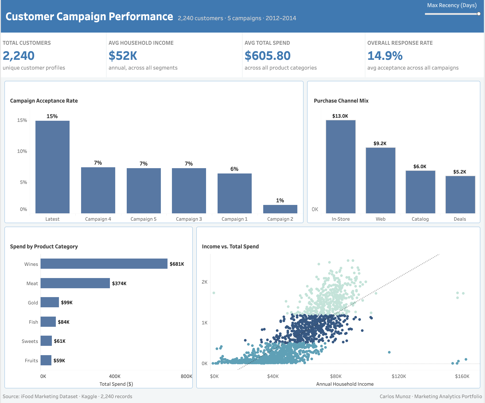

# Customer Campaign Performance Dashboard

**iFood Marketing Dataset · Campaign Response & Spend Analysis**

---

## Overview

This interactive Tableau dashboard visualizes customer behavior and campaign performance across five marketing campaigns for a food delivery platform. Built on the **iFood Marketing Dataset** (Kaggle), it translates customer-level data into clear segment insights to support retention and campaign strategy decisions.

The dashboard answers a core marketing question: **which campaigns resonated, which channels drive the most spend, and what does the customer profile behind each outcome look like?**

---

## Dashboard Preview

**[View Live Dashboard on Tableau Public →](https://public.tableau.com/app/profile/cmunoz/viz/FoodPaidMediaDashboard/Dashboard)**

---

## What I Built

**KPI Row**
Four headline metrics summarizing the customer base at a glance:
- Total Customers · Avg Household Income · Avg Total Spend · Overall Response Rate

**Campaign Acceptance Rate**
Bar chart comparing acceptance rates across all 5 campaigns plus the latest campaign — quickly surfaces which campaigns outperformed the baseline.

**Purchase Channel Mix**
Revenue by channel (In-Store, Web, Catalog, Deals) — shows where customers actually complete purchases versus where they browse.

**Spend by Product Category**
Horizontal bar chart ranking spend across Wines, Meat, Gold, Fish, Sweets, and Fruits — identifies where wallet share is concentrated.

**Income vs. Total Spend Scatter**
Scatter plot with recency filter — reveals the relationship between household income and total spend, and how recently active customers differ from lapsed ones.

**Interactive Filter**
Max Recency (Days) slider updates all views — lets stakeholders explore how customer behavior shifts between recently active and lapsed segments.

---

## Key Findings

- **Latest campaign outperformed all prior campaigns** — 15% acceptance rate vs. 6–7% for Campaigns 1–5
- **In-Store is the dominant channel** at $13K, nearly 1.5× Web ($9.2K) — physical presence still drives the majority of revenue
- **Wines dominate spend** at $681K — nearly double Meat ($374K), the second highest category
- **Overall response rate of 14.9%** — modest but consistent across the customer base, with the latest campaign nearly doubling it
- **Income and spend are positively correlated** — higher-income customers spend more, with the relationship strongest in the $40K–$100K income band

---

## Recommendation

Focus retention spend on the $40K–$100K income segment — they represent the densest cluster in the spend-income relationship and respond at above-average rates. The latest campaign's 15% acceptance rate suggests the messaging and offer resonated — replicating its structure for a follow-up campaign targeting lapsed customers (high recency days) in the same income band is the highest-probability next move.

---

## Tools & Skills

Tableau Public · KPI Design · Bar Charts · Scatter Plot · Interactive Filters · Parameter Controls · Customer Segmentation · Campaign Response Analysis · Channel Performance

---

## Data Source

**iFood Marketing Dataset** via Kaggle  
2,240 customer records · 5 campaigns · 6 product categories · 4 purchase channels  
Features: demographics, purchase history, campaign response flags, channel engagement

*Dataset used for portfolio and analytical purposes.*

---

## Related Work

The Python EDA for this dataset — customer profiling, spend distributions, and campaign comparison — lives in the parent folder:

**[Campaign Performance Analysis (Python notebook) →](../)**

---

*Carlos Munoz · MS in Marketing Analytics, CSU East Bay · Marketing Analytics Portfolio*
