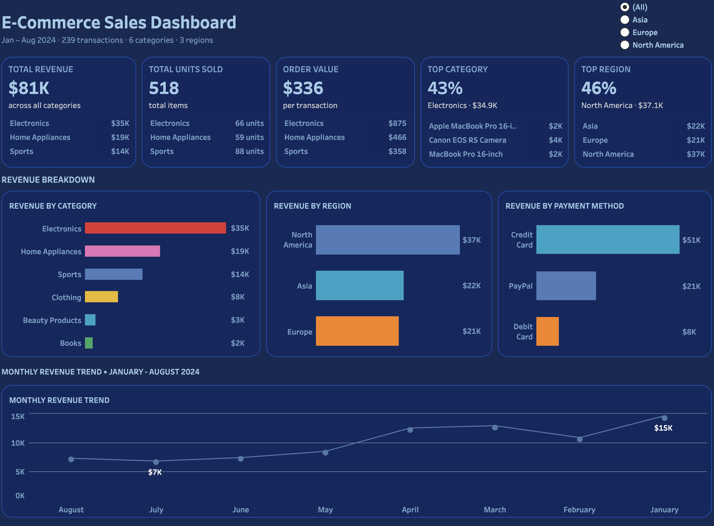
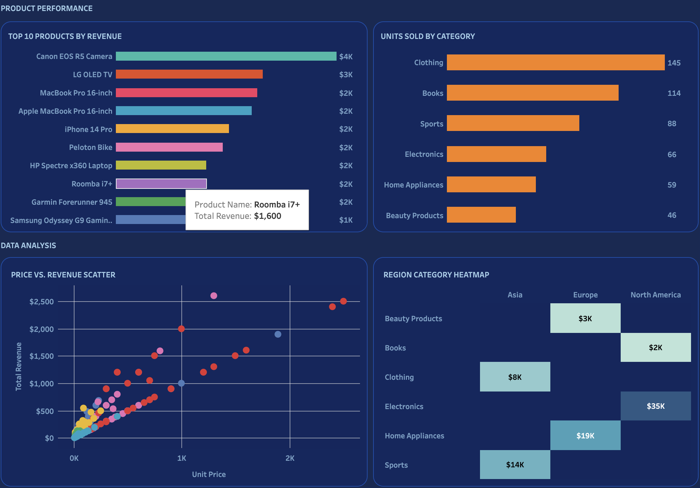

# E-Commerce Sales Dashboard

**Jan – Aug 2024 · 239 transactions · 6 categories · 3 regions**

---

## Overview

This interactive Tableau dashboard analyzes e-commerce sales performance across products, regions, and payment methods for an 8-month period. Built on a transactional sales dataset, it surfaces revenue concentration, product efficiency, and regional demand patterns to support inventory and marketing decisions.

---

## Dashboard Preview

**[View Live Dashboard on Tableau Public →](#)**

---

## What I Built

**KPI Row (5 tiles with Top 3 breakdowns)**
- Total Revenue · Total Units Sold · Avg Order Value · Top Category % · Top Region %
- Each tile shows the top 3 contributors beneath the headline number

**Revenue Breakdown (3 charts)**
- Revenue by Category — Electronics leads at $35K (43% of total)
- Revenue by Region — North America at $37K (46% of total)
- Revenue by Payment Method — Credit Card dominant at $51K

**Monthly Revenue Trend**
- Line chart Jan–Aug 2024 showing revenue pattern across 8 months
- Interactive Region filter updates the trend in real time

**Product Performance**
- Top 10 Products by Revenue — Canon EOS R5 Camera leads at $4K
- Units Sold by Category — Clothing leads volume at 145 units

**Data Analysis**
- Price vs Revenue Scatter — relationship between unit price and transaction revenue by product
- Region × Category Heatmap — color intensity shows revenue concentration across 18 cells

---

## Key Findings

- **Electronics drives 43% of revenue** ($35K) from only 66 units — highest revenue per unit of any category
- **Clothing leads volume** at 145 units but generates 4× less revenue than Electronics — clear price/volume tradeoff
- **North America accounts for 46% of revenue** — Europe and Asia nearly tied at 26% and 28%
- **Credit Card outpaces PayPal** $51K to $21K — payment method preference tracks with region
- **Canon EOS R5 Camera is the top product** at $4K — single product driving outsized Electronics revenue

---

## Recommendation

Prioritize inventory and marketing spend on Electronics — specifically high-ticket camera and laptop SKUs — for North America. Despite lower unit volume, Electronics returns the highest revenue per transaction. A targeted paid media campaign for Electronics in Europe and Asia could close the regional gap given those markets already show strong Home Appliances and Clothing demand.

---

## Calculated Fields

| Field | Formula |
|---|---|
| Avg Order Value | `SUM([Total Revenue]) / COUNT([Transaction ID])` |
| Month Name | `DATENAME('month', [Date])` |
| Month Number | `MONTH([Date])` |
| Top Category Pct | `SUM(IF [Product Category] = "Electronics" THEN [Total Revenue] END) / SUM([Total Revenue])` |
| Top Region Pct | `SUM(IF [Region] = "North America" THEN [Total Revenue] END) / SUM([Total Revenue])` |

---

## Tools & Skills

Tableau Public · KPI Design · Dual-Axis Charts · Heatmap · Scatter Plot · Line Chart · Interactive Filters · Calculated Fields · Product Mix Analysis · Regional Performance · E-Commerce Analytics

---

## Data Source

E-Commerce Sales EDA dataset · 239 transactions · Jan–Aug 2024
Fields: Transaction ID, Date, Product Category, Product Name, Units Sold, Unit Price, Total Revenue, Region, Payment Method

---

*Carlos Munoz · MS in Marketing Analytics, CSU East Bay · Marketing Analytics Portfolio*
